# Diseño del sistema

## Diagrama de casos de uso

### Propósito

El diagrama representa las interacciones de los tres actores con las funciones principales del sistema integrado. El límite exterior contiene el bot de Telegram y el panel web de administración; ambos utilizan la misma lógica de negocio y la misma base de datos.

Las asociaciones indican qué actor puede iniciar cada caso de uso. No representan el orden temporal del flujo, que se documenta en [flujo-conversacional.md](flujo-conversacional.md).

### Actores

| Actor | Canal | Responsabilidad general |
|---|---|---|
| Cliente | Bot de Telegram | Crear, pagar y consultar sus pedidos. |
| Repartidor | Bot de Telegram | Atender los pedidos asignados y registrar el trayecto y la entrega. |
| Administrador | Panel web | Configurar la operación y controlar pedidos, pagos y repartos. |

### Diagrama

```mermaid
flowchart TB
    CLIENTE[Cliente]
    REPARTIDOR[Repartidor]
    ADMIN[Administrador]

    subgraph SISTEMA["Chatbot Restaurante MVP"]
        direction TB

        subgraph BOT_CLIENTE["Bot de Telegram - Cliente"]
            direction TB
            C1(["CU-CLI-01: Consultar el menú"])
            C2(["CU-CLI-02: Gestionar el carrito"])
            C3(["CU-CLI-03: Enviar ubicación de entrega"])
            C4(["CU-CLI-04: Recibir el QR de pago"])
            C5(["CU-CLI-05: Enviar el comprobante"])
            C6(["CU-CLI-06: Consultar estado del pedido"])
            C7(["CU-CLI-07: Cancelar o reiniciar el flujo"])
        end

        subgraph BOT_REPARTIDOR["Bot de Telegram - Repartidor"]
            direction TB
            R1(["CU-REP-01: Autenticarse"])
            R2(["CU-REP-02: Recibir pedido asignado"])
            R3(["CU-REP-03: Confirmar recepción"])
            R4(["CU-REP-04: Compartir ubicación en vivo"])
            R5(["CU-REP-05: Confirmar llegada"])
            R6(["CU-REP-06: Confirmar entrega"])
        end

        subgraph PANEL["Panel web de administración"]
            direction TB
            A1(["CU-ADM-01: Autenticarse en el panel"])
            A2(["CU-ADM-02: Gestionar platos y menús"])
            A3(["CU-ADM-03: Controlar disponibilidad y stock"])
            A4(["CU-ADM-04: Administrar pedidos y estados"])
            A5(["CU-ADM-05: Confirmar pagos"])
            A6(["CU-ADM-06: Asignar o reasignar repartidores"])
            A7(["CU-ADM-07: Supervisar ubicación del repartidor"])
            A8(["CU-ADM-08: Consultar clientes y reportes"])
        end
    end

    CLIENTE --> C1
    CLIENTE --> C2
    CLIENTE --> C3
    CLIENTE --> C4
    CLIENTE --> C5
    CLIENTE --> C6
    CLIENTE --> C7

    REPARTIDOR --> R1
    REPARTIDOR --> R2
    REPARTIDOR --> R3
    REPARTIDOR --> R4
    REPARTIDOR --> R5
    REPARTIDOR --> R6

    ADMIN --> A1
    ADMIN --> A2
    ADMIN --> A3
    ADMIN --> A4
    ADMIN --> A5
    ADMIN --> A6
    ADMIN --> A7
    ADMIN --> A8
```

## Descripción de los casos de uso

### Cliente

| ID | Caso de uso | Resultado esperado |
|---|---|---|
| CU-CLI-01 | Consultar el menú | Visualiza únicamente los platos disponibles para la fecha actual. |
| CU-CLI-02 | Gestionar el carrito | Añade, modifica o elimina platos y cantidades antes de confirmar. |
| CU-CLI-03 | Enviar ubicación de entrega | Registra el destino mediante un objeto nativo `Location`. |
| CU-CLI-04 | Recibir el QR de pago | Obtiene el QR configurado después de validar carrito, stock y ubicación. |
| CU-CLI-05 | Enviar el comprobante | Adjunta un archivo asociado al pedido para revisión manual. |
| CU-CLI-06 | Consultar estado del pedido | Consulta únicamente pedidos propios mediante su código de seguimiento. |
| CU-CLI-07 | Cancelar o reiniciar el flujo | Limpia datos conversacionales temporales sin borrar pedidos persistidos. |

### Repartidor

| ID | Caso de uso | Resultado esperado |
|---|---|---|
| CU-REP-01 | Autenticarse | Accede al flujo de reparto únicamente con un `chat_id` habilitado. |
| CU-REP-02 | Recibir pedido asignado | Recibe datos completos del pedido, cliente y ubicación. |
| CU-REP-03 | Confirmar recepción | Registra el acuse del pedido asignado sin duplicar eventos. |
| CU-REP-04 | Compartir ubicación en vivo | Inicia y actualiza el rastro mediante `live location` de Telegram. |
| CU-REP-05 | Confirmar llegada | Registra la llegada como evento distinto de la entrega. |
| CU-REP-06 | Confirmar entrega | Completa la entrega con fotografía o código como evidencia. |

### Administrador

| ID | Caso de uso | Resultado esperado |
|---|---|---|
| CU-ADM-01 | Autenticarse en el panel | Accede únicamente con credenciales válidas. |
| CU-ADM-02 | Gestionar platos y menús | Crea, consulta, edita o elimina platos y configura el menú por fecha. |
| CU-ADM-03 | Controlar disponibilidad y stock | Mantiene cantidades no negativas y disponibilidad consistente. |
| CU-ADM-04 | Administrar pedidos y estados | Consulta el tablero y ejecuta solo transiciones permitidas. |
| CU-ADM-05 | Confirmar pagos | Revisa el comprobante y confirma u observa el pago manualmente. |
| CU-ADM-06 | Asignar o reasignar repartidores | Mantiene un único repartidor activo por pedido. |
| CU-ADM-07 | Supervisar ubicación del repartidor | Consulta destino, última posición, señal y llegada en el mapa. |
| CU-ADM-08 | Consultar clientes y reportes | Revisa historial y frecuencia del cliente, ventas, platos más pedidos y tiempo promedio de entrega. |

## Límites de acceso

- El cliente no puede consultar pedidos pertenecientes a otro `chat_id`.
- El repartidor solo puede operar pedidos con una asignación activa a su nombre.
- El administrador no utiliza el bot para modificar la operación; lo hace desde el panel protegido.
- La confirmación del pago corresponde únicamente al administrador.
- La asignación o reasignación corresponde únicamente al administrador.
- La llegada y la entrega corresponden únicamente al repartidor activo.
- Todos los actores acceden al mismo pedido y al mismo modelo de estados según sus permisos.

## Trazabilidad

| Elemento | Documento relacionado |
|---|---|
| Alcance, actores e historias de usuario | [requisitos.md](requisitos.md) |
| Estados y transiciones permitidas | [maquina-estados.md](maquina-estados.md) |
| Secuencia y ramificaciones del bot | [flujo-conversacional.md](flujo-conversacional.md) |
| Decisiones de arquitectura y tecnologías | [decisiones-tecnicas.md](decisiones-tecnicas.md) |

Este diagrama deberá mantenerse consistente con la implementación. Los siguientes apartados de diseño se añadirán al mismo archivo mediante issues independientes.
