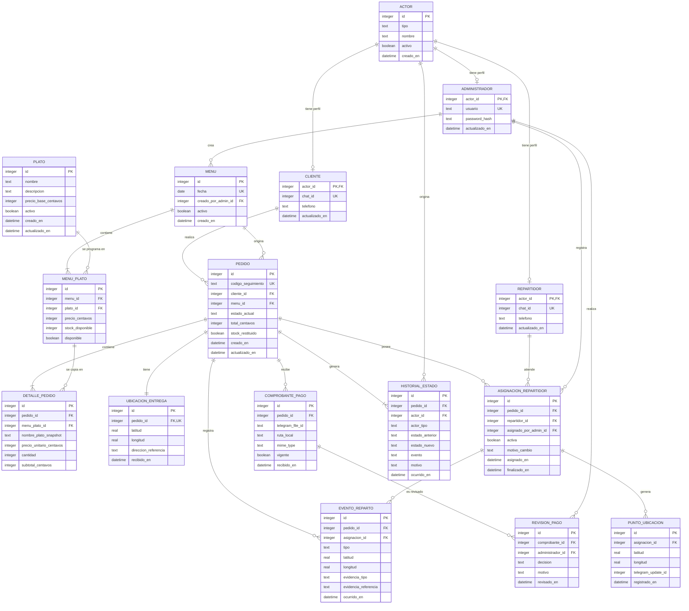

# Diseño del sistema

## Diagrama de casos de uso

### Propósito

El diagrama representa las interacciones de los tres actores con las funciones principales del sistema integrado. El límite exterior contiene el bot de Telegram y el panel web de administración; ambos utilizan la misma lógica de negocio y la misma base de datos.

Las asociaciones indican qué actor puede iniciar cada caso de uso. No representan el orden temporal del flujo, que se documenta en [flujo-conversacional.md](flujo-conversacional.md).

### Actores

| Actor | Canal | Responsabilidad general |
|---|---|---|
| Cliente | Bot de Telegram | Crear, pagar y consultar sus pedidos. |
| Repartidor | Bot de Telegram | Atender los pedidos asignados y registrar el trayecto y la entrega. |
| Administrador | Panel web | Configurar la operación y controlar pedidos, pagos y repartos. |

### Diagrama

```mermaid
flowchart TB
    CLIENTE[Cliente]
    REPARTIDOR[Repartidor]
    ADMIN[Administrador]

    subgraph SISTEMA["Chatbot Restaurante MVP"]
        direction TB

        subgraph BOT_CLIENTE["Bot de Telegram - Cliente"]
            direction TB
            C1(["CU-CLI-01: Consultar el menú"])
            C2(["CU-CLI-02: Gestionar el carrito"])
            C3(["CU-CLI-03: Enviar ubicación de entrega"])
            C4(["CU-CLI-04: Recibir el QR de pago"])
            C5(["CU-CLI-05: Enviar el comprobante"])
            C6(["CU-CLI-06: Consultar estado del pedido"])
            C7(["CU-CLI-07: Cancelar o reiniciar el flujo"])
        end

        subgraph BOT_REPARTIDOR["Bot de Telegram - Repartidor"]
            direction TB
            R1(["CU-REP-01: Autenticarse"])
            R2(["CU-REP-02: Recibir pedido asignado"])
            R3(["CU-REP-03: Confirmar recepción"])
            R4(["CU-REP-04: Compartir ubicación en vivo"])
            R5(["CU-REP-05: Confirmar llegada"])
            R6(["CU-REP-06: Confirmar entrega"])
        end

        subgraph PANEL["Panel web de administración"]
            direction TB
            A1(["CU-ADM-01: Autenticarse en el panel"])
            A2(["CU-ADM-02: Gestionar platos y menús"])
            A3(["CU-ADM-03: Controlar disponibilidad y stock"])
            A4(["CU-ADM-04: Administrar pedidos y estados"])
            A5(["CU-ADM-05: Confirmar pagos"])
            A6(["CU-ADM-06: Asignar o reasignar repartidores"])
            A7(["CU-ADM-07: Supervisar ubicación del repartidor"])
            A8(["CU-ADM-08: Consultar clientes y reportes"])
        end
    end

    CLIENTE --> C1
    CLIENTE --> C2
    CLIENTE --> C3
    CLIENTE --> C4
    CLIENTE --> C5
    CLIENTE --> C6
    CLIENTE --> C7

    REPARTIDOR --> R1
    REPARTIDOR --> R2
    REPARTIDOR --> R3
    REPARTIDOR --> R4
    REPARTIDOR --> R5
    REPARTIDOR --> R6

    ADMIN --> A1
    ADMIN --> A2
    ADMIN --> A3
    ADMIN --> A4
    ADMIN --> A5
    ADMIN --> A6
    ADMIN --> A7
    ADMIN --> A8
```

## Descripción de los casos de uso

### Cliente

| ID | Caso de uso | Resultado esperado |
|---|---|---|
| CU-CLI-01 | Consultar el menú | Visualiza únicamente los platos disponibles para la fecha actual. |
| CU-CLI-02 | Gestionar el carrito | Añade, modifica o elimina platos y cantidades antes de confirmar. |
| CU-CLI-03 | Enviar ubicación de entrega | Registra el destino mediante un objeto nativo `Location`. |
| CU-CLI-04 | Recibir el QR de pago | Obtiene el QR configurado después de validar carrito, stock y ubicación. |
| CU-CLI-05 | Enviar el comprobante | Adjunta un archivo asociado al pedido para revisión manual. |
| CU-CLI-06 | Consultar estado del pedido | Consulta únicamente pedidos propios mediante su código de seguimiento. |
| CU-CLI-07 | Cancelar o reiniciar el flujo | Limpia datos conversacionales temporales sin borrar pedidos persistidos. |

### Repartidor

| ID | Caso de uso | Resultado esperado |
|---|---|---|
| CU-REP-01 | Autenticarse | Accede al flujo de reparto únicamente con un `chat_id` habilitado. |
| CU-REP-02 | Recibir pedido asignado | Recibe datos completos del pedido, cliente y ubicación. |
| CU-REP-03 | Confirmar recepción | Registra el acuse del pedido asignado sin duplicar eventos. |
| CU-REP-04 | Compartir ubicación en vivo | Inicia y actualiza el rastro mediante `live location` de Telegram. |
| CU-REP-05 | Confirmar llegada | Registra la llegada como evento distinto de la entrega. |
| CU-REP-06 | Confirmar entrega | Completa la entrega con fotografía o código como evidencia. |

### Administrador

| ID | Caso de uso | Resultado esperado |
|---|---|---|
| CU-ADM-01 | Autenticarse en el panel | Accede únicamente con credenciales válidas. |
| CU-ADM-02 | Gestionar platos y menús | Crea, consulta, edita o elimina platos y configura el menú por fecha. |
| CU-ADM-03 | Controlar disponibilidad y stock | Mantiene cantidades no negativas y disponibilidad consistente. |
| CU-ADM-04 | Administrar pedidos y estados | Consulta el tablero y ejecuta solo transiciones permitidas. |
| CU-ADM-05 | Confirmar pagos | Revisa el comprobante y confirma u observa el pago manualmente. |
| CU-ADM-06 | Asignar o reasignar repartidores | Mantiene un único repartidor activo por pedido. |
| CU-ADM-07 | Supervisar ubicación del repartidor | Consulta destino, última posición, señal y llegada en el mapa. |
| CU-ADM-08 | Consultar clientes y reportes | Revisa historial y frecuencia del cliente, ventas, platos más pedidos y tiempo promedio de entrega. |

## Límites de acceso

- El cliente no puede consultar pedidos pertenecientes a otro `chat_id`.
- El repartidor solo puede operar pedidos con una asignación activa a su nombre.
- El administrador no utiliza el bot para modificar la operación; lo hace desde el panel protegido.
- La confirmación del pago corresponde únicamente al administrador.
- La asignación o reasignación corresponde únicamente al administrador.
- La llegada y la entrega corresponden únicamente al repartidor activo.
- Todos los actores acceden al mismo pedido y al mismo modelo de estados según sus permisos.

## Trazabilidad

| Elemento | Documento relacionado |
|---|---|
| Alcance, actores e historias de usuario | [requisitos.md](requisitos.md) |
| Estados y transiciones permitidas | [maquina-estados.md](maquina-estados.md) |
| Secuencia y ramificaciones del bot | [flujo-conversacional.md](flujo-conversacional.md) |
| Decisiones de arquitectura y tecnologías | [decisiones-tecnicas.md](decisiones-tecnicas.md) |

Este diagrama deberá mantenerse consistente con la implementación. Los siguientes apartados de diseño se añadirán al mismo archivo mediante issues independientes.

---

## Modelo entidad-relación

### Propósito y alcance

Este modelo representa la información necesaria para el bot de Telegram y el panel web en una única base de datos SQLite. Es un diseño inicial: las migraciones posteriores deberán conservar la trazabilidad con este documento y actualizarlo cuando la implementación exija un cambio.

Criterios aplicados:

- Las claves primarias internas son enteros.
- Los identificadores externos, como `chat_id` y código de seguimiento, son únicos.
- Los importes se almacenan como enteros en centavos para evitar errores de punto flotante.
- Las fechas y horas se guardan en UTC y la zona local se aplica al mostrar o agrupar reportes.
- Los datos históricos usan bajas lógicas o restricciones de borrado.
- El detalle del pedido conserva nombre y precio como instantánea, aunque el plato cambie después.

### Diagrama

### Diccionario de entidades

| Entidad | Propósito | Clave primaria | Claves foráneas | Atributos principales |
|---|---|---|---|---|
| `ACTOR` | Identidad común para auditoría de personas. | `id` | Ninguna. | Tipo, nombre, activo y fecha de creación. |
| `CLIENTE` | Perfil del cliente identificado por Telegram. | `actor_id` | `actor_id → ACTOR.id`. | `chat_id` único, teléfono y actualización. |
| `REPARTIDOR` | Perfil habilitado para acciones de reparto. | `actor_id` | `actor_id → ACTOR.id`. | `chat_id` único, teléfono y actualización. |
| `ADMINISTRADOR` | Credenciales y perfil de acceso al panel. | `actor_id` | `actor_id → ACTOR.id`. | Usuario único, hash de contraseña y actualización. |
| `PLATO` | Catálogo reutilizable de platos. | `id` | Ninguna. | Nombre, descripción, precio base y estado activo. |
| `MENU` | Menú programado para una fecha. | `id` | `creado_por_admin_id → ADMINISTRADOR.actor_id`. | Fecha única, activo y fecha de creación. |
| `MENU_PLATO` | Asociación diaria de platos con precio, disponibilidad y stock. | `id` | `menu_id → MENU.id`; `plato_id → PLATO.id`. | Precio del día, stock disponible y disponibilidad. |
| `PEDIDO` | Cabecera y estado actual del pedido. | `id` | `cliente_id → CLIENTE.actor_id`; `menu_id → MENU.id`. | Código único, estado, total, control de restitución y fechas. |
| `DETALLE_PEDIDO` | Líneas del pedido con valores históricos. | `id` | `pedido_id → PEDIDO.id`; `menu_plato_id → MENU_PLATO.id`. | Nombre y precio instantáneos, cantidad y subtotal. |
| `UBICACION_ENTREGA` | Destino único del pedido. | `id` | `pedido_id → PEDIDO.id`, también único. | Latitud, longitud, referencia y fecha de recepción. |
| `COMPROBANTE_PAGO` | Archivos enviados por el cliente. | `id` | `pedido_id → PEDIDO.id`. | Identificador de Telegram, ruta local, tipo, vigencia y fecha. |
| `REVISION_PAGO` | Decisión manual sobre un comprobante. | `id` | `comprobante_id → COMPROBANTE_PAGO.id`; `administrador_id → ADMINISTRADOR.actor_id`. | Decisión, motivo y fecha. |
| `ASIGNACION_REPARTIDOR` | Historial de asignaciones y reasignaciones. | `id` | `pedido_id → PEDIDO.id`; `repartidor_id → REPARTIDOR.actor_id`; `asignado_por_admin_id → ADMINISTRADOR.actor_id`. | Estado activo, motivo y período de vigencia. |
| `HISTORIAL_ESTADO` | Auditoría de transiciones del pedido. | `id` | `pedido_id → PEDIDO.id`; `actor_id → ACTOR.id`, anulable para eventos del sistema. | Actor, estados, evento, motivo y fecha. |
| `PUNTO_UBICACION` | Rastro de una asignación concreta. | `id` | `asignacion_id → ASIGNACION_REPARTIDOR.id`. | Coordenadas, actualización de Telegram y fecha. |
| `EVENTO_REPARTO` | Llegada y entrega como eventos separados. | `id` | `pedido_id → PEDIDO.id`; `asignacion_id → ASIGNACION_REPARTIDOR.id`. | Tipo, coordenadas, evidencia y fecha. |

### Relaciones y cardinalidades

| Relación | Cardinalidad | Regla |
|---|---|---|
| `ACTOR — CLIENTE/REPARTIDOR/ADMINISTRADOR` | 1 a 0..1 por perfil | El valor `tipo` determina exactamente un perfil especializado. |
| `ADMINISTRADOR — MENU` | 1 a 0..N | Un administrador puede crear varios menús; cada menú conserva su creador. |
| `MENU — MENU_PLATO` | 1 a 1..N | Un menú publicado debe contener al menos un plato. |
| `PLATO — MENU_PLATO` | 1 a 0..N | Un plato puede programarse en diferentes fechas. |
| `CLIENTE — PEDIDO` | 1 a 0..N | Cada pedido pertenece a un solo cliente. |
| `MENU — PEDIDO` | 1 a 0..N | Cada pedido se origina en un menú específico. |
| `PEDIDO — DETALLE_PEDIDO` | 1 a 1..N | Un pedido confirmado contiene al menos una línea. |
| `MENU_PLATO — DETALLE_PEDIDO` | 1 a 0..N | La línea referencia la opción comprada y conserva una instantánea. |
| `PEDIDO — UBICACION_ENTREGA` | 1 a 1 | Cada pedido tiene un único destino. |
| `PEDIDO — COMPROBANTE_PAGO` | 1 a 0..N | Se conservan reenvíos; solo uno puede estar vigente. |
| `COMPROBANTE_PAGO — REVISION_PAGO` | 1 a 0..N | Cada decisión manual queda registrada sin borrar revisiones anteriores. |
| `ADMINISTRADOR — REVISION_PAGO` | 1 a 0..N | Cada revisión identifica al administrador responsable. |
| `PEDIDO — ASIGNACION_REPARTIDOR` | 1 a 0..N | Las reasignaciones se conservan; solo una puede estar activa. |
| `REPARTIDOR — ASIGNACION_REPARTIDOR` | 1 a 0..N | Un repartidor puede atender distintos pedidos a lo largo del tiempo. |
| `ADMINISTRADOR — ASIGNACION_REPARTIDOR` | 1 a 0..N | Cada asignación registra quién la realizó. |
| `PEDIDO — HISTORIAL_ESTADO` | 1 a 1..N | La creación genera la primera entrada y cada transición añade otra. |
| `ACTOR — HISTORIAL_ESTADO` | 1 a 0..N | El actor es opcional únicamente cuando el origen es el sistema. |
| `ASIGNACION_REPARTIDOR — PUNTO_UBICACION` | 1 a 0..N | Cada rastro queda separado incluso después de una reasignación. |
| `PEDIDO — EVENTO_REPARTO` | 1 a 0..2 | Puede registrar una llegada y una entrega. |
| `ASIGNACION_REPARTIDOR — EVENTO_REPARTO` | 1 a 0..N | El evento identifica al repartidor activo que lo produjo. |

### Restricciones de integridad

La implementación debe aplicar como mínimo:

- `PRAGMA foreign_keys = ON` en cada conexión SQLite.
- `UNIQUE (menu_id, plato_id)` en `MENU_PLATO`.
- `CHECK (precio_centavos >= 0)`, `CHECK (stock_disponible >= 0)` y `CHECK (cantidad > 0)`.
- `CHECK (subtotal_centavos = precio_unitario_centavos * cantidad)` o cálculo exclusivo en el servicio.
- Índice único parcial sobre `ASIGNACION_REPARTIDOR(pedido_id) WHERE activa = 1`.
- Índice único parcial sobre `COMPROBANTE_PAGO(pedido_id) WHERE vigente = 1`.
- `UNIQUE (asignacion_id, telegram_update_id)` para evitar puntos duplicados.
- `UNIQUE (pedido_id, tipo)` en `EVENTO_REPARTO`, con tipos `LLEGADA` y `ENTREGA`.
- Evidencia obligatoria cuando `EVENTO_REPARTO.tipo = ENTREGA`.
- `actor_id` nulo únicamente cuando `HISTORIAL_ESTADO.actor_tipo = SISTEMA`.
- Estado actual limitado a los códigos de [maquina-estados.md](maquina-estados.md).
- Borrado restringido para pedidos y registros históricos; platos, personas y menús referenciados se desactivan.

### Reglas transaccionales

- Crear el pedido, sus detalles, la ubicación, la primera entrada del historial y el descuento de stock en una sola transacción.
- Confirmar una transición y añadir su historial en la misma transacción.
- Desactivar una asignación anterior y crear la nueva de forma atómica.
- Confirmar la entrega solo si existe llegada previa y evidencia válida.
- Restituir stock como máximo una vez al cancelar, usando `PEDIDO.stock_restituido`.
- Los reportes se calculan desde pedidos, detalles, revisiones y eventos; no se almacenan totales derivados en tablas separadas.

### Correspondencia con los requisitos

| Requisito | Entidades |
|---|---|
| Clientes por `chat_id` | `ACTOR`, `CLIENTE` |
| Administradores y repartidores | `ACTOR`, `ADMINISTRADOR`, `REPARTIDOR` |
| Platos, precio, disponibilidad y stock | `PLATO`, `MENU`, `MENU_PLATO` |
| Pedidos y detalles | `PEDIDO`, `DETALLE_PEDIDO` |
| Ubicación de entrega | `UBICACION_ENTREGA` |
| Comprobante y confirmación manual | `COMPROBANTE_PAGO`, `REVISION_PAGO` |
| Asignación y reasignación | `ASIGNACION_REPARTIDOR` |
| Estado e historial | `PEDIDO`, `HISTORIAL_ESTADO` |
| Rastro del repartidor | `PUNTO_UBICACION` |
| Llegada y entrega | `EVENTO_REPARTO` |

El modelo se implementará mediante migraciones SQL versionadas. Cualquier diferencia entre el esquema real y este diseño deberá corregirse antes de la entrega final.

