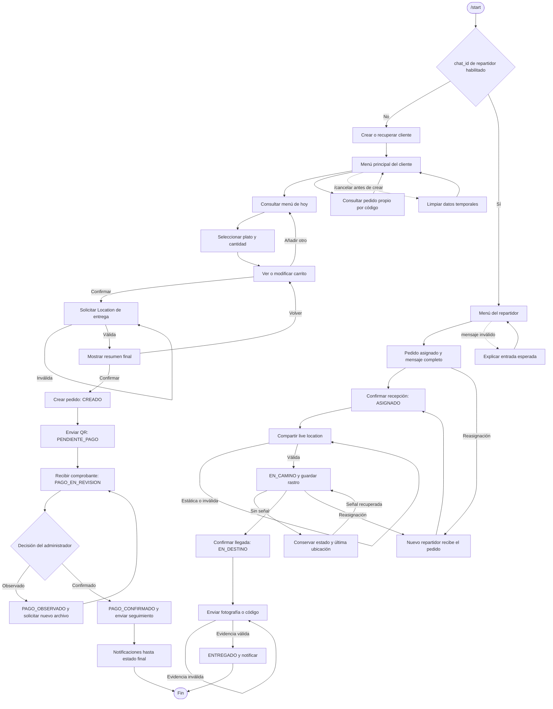

# Flujo conversacional del bot

## 1. Propósito

Este documento define la conversación completa del bot de Telegram para clientes y repartidores. Ambos flujos utilizan el mismo pedido y la misma máquina de estados que el panel web.

El **paso conversacional** indica qué entrada espera el bot de una persona. El **estado del pedido** representa el avance persistente del negocio. Son conceptos distintos: un mensaje inválido puede mantener el mismo paso conversacional sin modificar el pedido.

## 2. Punto de inicio e identificación del rol

Toda conversación comienza con `/start`:

1. El bot obtiene el `chat_id`.
2. Si el `chat_id` pertenece a un repartidor habilitado desde el panel, inicia el flujo de repartidor.
3. En otro caso, crea o recupera el perfil del cliente e inicia el flujo de cliente.
4. Un usuario no habilitado como repartidor no puede acceder a pedidos ni acciones de reparto.
5. El administrador opera únicamente desde el panel web; sus cambios generan notificaciones en el bot.

La identificación se repite antes de cada acción sensible. No basta con haber abierto previamente un botón: el bot vuelve a comprobar el rol, el pedido, la asignación activa y el estado actual.

## 3. Controles y comandos

| Control | Uso |
|---|---|
| `/start` | Identifica el rol y muestra el menú principal correspondiente. |
| `/cancelar` | Cancela el paso conversacional actual según las reglas de la sección 8; no cancela silenciosamente un pedido persistido. |
| `/ayuda` | Explica las acciones disponibles sin perder el paso válido. |
| `InlineKeyboardMarkup` | Selección de platos, cantidades, carrito, seguimiento, acuse, llegada y entrega. |
| Botón para compartir ubicación | Solicita al cliente una ubicación estática de destino mediante el objeto nativo `Location`. |
| Ubicación en vivo de Telegram | Inicia y actualiza el rastro del repartidor; una ubicación estática no inicia el trayecto. |
| Envío de fotografía o documento | Recibe comprobantes de pago y evidencia fotográfica de entrega. |

Cada pulsación de un botón responde a la consulta de Telegram, incluso cuando se rechaza, para evitar que el indicador del cliente quede cargando.

## 4. Flujo del cliente

### 4.1. Inicio y menú principal

1. El cliente envía `/start`.
2. El bot crea o recupera un único perfil por `chat_id`.
3. Muestra estas opciones:
   - **Ver menú**.
   - **Ver carrito**, cuando existe contenido temporal.
   - **Seguir pedido**.
   - **Ayuda**.
4. Si no existe menú para la fecha actual, informa la situación y vuelve al menú principal.

### 4.2. Selección de platos y cantidades

1. El bot muestra únicamente platos disponibles para la fecha actual.
2. Cada plato incluye nombre, descripción breve, precio y disponibilidad.
3. El cliente selecciona un plato mediante un botón inline.
4. El bot solicita una cantidad entera positiva.
5. Valida la cantidad contra el stock disponible.
6. Si la cantidad es válida, añade o actualiza el plato en el carrito.
7. Si no es válida, explica el rango permitido y conserva la selección actual.
8. Después de cada cambio permite:
   - Añadir otro plato.
   - Cambiar una cantidad.
   - Eliminar un plato.
   - Vaciar el carrito.
   - Confirmar el carrito.
   - Volver al menú principal.

La validación durante el carrito es preliminar. Al confirmar el pedido se vuelve a verificar el stock dentro de la transacción de creación.

### 4.3. Carrito y confirmación

El carrito muestra cada plato, cantidad, precio unitario, subtotal y total.

Antes de continuar:

- El carrito no puede estar vacío.
- Todas las cantidades deben seguir disponibles.
- El cliente debe confirmar expresamente el resumen.
- Una pulsación repetida de **Confirmar** no crea dos pedidos.

Al confirmar un carrito válido, el bot solicita la ubicación de entrega.

### 4.4. Ubicación de entrega

1. El bot muestra un botón para compartir la ubicación.
2. Solo acepta un mensaje que contenga un objeto nativo `Location`.
3. Una dirección escrita, una fotografía del mapa o un texto con coordenadas no sustituyen el objeto requerido.
4. Si la entrada es inválida, explica cómo compartir la ubicación y permanece en el mismo paso.
5. Después de recibirla, muestra el resumen final con pedido, total y ubicación.
6. El cliente puede volver al carrito o confirmar el pedido.

### 4.5. Creación, QR y comprobante

Al confirmar el resumen final:

1. El sistema vuelve a validar el stock.
2. Crea atómicamente el pedido, sus detalles, la ubicación y el código de seguimiento.
3. Descuenta el stock y establece el estado `CREADO`.
4. Envía el QR mediante la función nativa para fotografías.
5. Solo después de un envío correcto cambia a `PENDIENTE_PAGO`.
6. Solicita el comprobante en formato de fotografía o documento permitido.
7. Al recibir un archivo válido, lo asocia al pedido y cambia a `PAGO_EN_REVISION`.
8. Informa: **Comprobante recibido; el pago aún debe ser verificado por el administrador**.

Si el QR no está configurado o no puede enviarse, el pedido conserva `CREADO`; el bot informa el problema y permite reintentar sin crear otro pedido ni descontar stock otra vez.

### 4.6. Decisión del pago y seguimiento

La decisión la realiza el administrador desde el panel:

- **Pago observado:** el pedido pasa a `PAGO_OBSERVADO`; el bot comunica el motivo y solicita un nuevo comprobante. Un archivo válido lo devuelve a `PAGO_EN_REVISION`.
- **Pago confirmado:** el pedido pasa a `PAGO_CONFIRMADO`; el bot confirma la aprobación y comunica el código de seguimiento.

La opción **Seguir pedido**:

1. Permite elegir uno de los pedidos propios o introducir el código.
2. Verifica que el pedido pertenezca al `chat_id`.
3. Muestra el estado actual con un texto comprensible.
4. No revela datos de códigos inexistentes o pertenecientes a otro cliente.
5. Ofrece volver al menú principal.

### 4.7. Notificaciones

El cliente recibe notificaciones diferenciadas después de registrar estos eventos:

- Pago observado.
- Pago confirmado.
- Repartidor asignado o reasignado.
- Pedido en camino.
- Repartidor en destino: **El repartidor llegó**.
- Pedido entregado.
- Pedido cancelado.
- Incidencia relevante que afecte el servicio.

Cada notificación incluye el código de seguimiento y el nuevo estado. Un reintento técnico no genera una notificación duplicada.

## 5. Flujo del repartidor

### 5.1. Autenticación y menú

1. El repartidor envía `/start`.
2. El sistema verifica que su `chat_id` esté habilitado.
3. Muestra:
   - **Pedidos asignados**.
   - **Pedido activo**, cuando corresponda.
   - **Ayuda**.
4. Solo lista pedidos cuya asignación activa pertenece a ese repartidor.

### 5.2. Recepción de un pedido asignado

Cuando el administrador asigna un pedido, el bot envía inmediatamente:

- Número y código del pedido.
- Platos y cantidades.
- Total y estado del pago.
- Nombre y contacto del cliente.
- Dirección o referencia registrada.
- Ubicación como objeto nativo `Location`.
- Estado actual.
- Botón **Confirmar recepción**.

Al pulsar el botón:

1. Se vuelve a validar que la asignación siga activa.
2. Se registra el acuse con repartidor, fecha y hora.
3. El pedido permanece en `ASIGNADO`.
4. El administrador recibe la confirmación.
5. Una segunda pulsación devuelve el resultado existente sin duplicarlo.

### 5.3. Inicio y seguimiento del trayecto

Después del acuse, el bot muestra **Iniciar trayecto** e indica cómo compartir una ubicación en vivo desde Telegram.

- Solo una `Location` con período en vivo inicia el trayecto.
- Una ubicación estática se rechaza con instrucciones.
- Al recibir la ubicación en vivo válida, el pedido pasa a `EN_CAMINO`.
- Cada actualización válida almacena latitud, longitud, fecha y hora.
- El panel utiliza la última posición y actualiza el mapa cada 15 segundos.
- Una marca temporal repetida no crea otro punto.

Si pasan 60 segundos sin actualización:

- El pedido permanece en `EN_CAMINO`.
- El panel muestra **Sin señal**, la última posición y su hora.
- El bot permite continuar cuando Telegram vuelva a enviar actualizaciones.
- El rastro anterior no se elimina.

### 5.4. Llegada al destino

El botón **Confirmar llegada** solo aparece para el repartidor activo cuando el pedido está `EN_CAMINO`.

Al pulsarlo:

1. Se valida la asignación y el estado.
2. Se registra fecha, hora y última ubicación disponible.
3. El pedido cambia a `EN_DESTINO`.
4. El panel se actualiza.
5. El cliente recibe **El repartidor llegó**.
6. El bot habilita **Confirmar entrega**.

La llegada no equivale a la entrega.

### 5.5. Entrega con evidencia

Al pulsar **Confirmar entrega**, el bot ofrece:

- **Enviar fotografía**.
- **Introducir código del cliente**.
- **Volver**.

El pedido solo cambia a `ENTREGADO` cuando:

- La evidencia corresponde al pedido.
- El repartidor sigue siendo el asignado.
- El estado continúa en `EN_DESTINO`.
- La fotografía es válida o el código coincide.

Después de confirmar:

1. Registra evidencia, repartidor, fecha y hora.
2. Detiene el seguimiento en vivo.
3. Actualiza el panel.
4. Notifica al cliente **Pedido entregado**.
5. Una acción repetida muestra que la entrega ya fue registrada.

### 5.6. Reasignación

Si el administrador reasigna:

- La asignación anterior deja de estar activa.
- El repartidor anterior recibe un aviso y pierde los botones operativos.
- Cualquier botón antiguo del repartidor anterior se rechaza.
- El nuevo repartidor recibe el mensaje completo, incluida la ubicación nativa.
- Si el pedido estaba `ASIGNADO`, conserva ese estado.
- Si estaba `EN_CAMINO`, vuelve a `ASIGNADO`, termina el seguimiento anterior y exige un nuevo acuse e inicio de trayecto.
- Los rastros permanecen asociados al repartidor que los generó.

## 6. Decisiones y ramificaciones

| Situación | Respuesta del bot | Resultado |
|---|---|---|
| No existe menú para hoy | Informa que no hay menú disponible. | Vuelve al menú principal. |
| Cantidad no numérica, cero o negativa | Indica que espera un entero positivo. | Conserva el plato y el paso. |
| Cantidad superior al stock | Muestra el máximo disponible. | No modifica el carrito. |
| Carrito vacío | Impide confirmar. | Permanece en el carrito. |
| Stock cambió antes de confirmar | Informa los platos afectados y cantidades disponibles. | Vuelve al carrito sin crear el pedido. |
| Ubicación de entrega inválida | Explica cómo usar el botón de ubicación. | Permanece esperando `Location`. |
| QR no configurado o envío fallido | Informa el problema y ofrece reintento. | Conserva `CREADO`. |
| Comprobante inválido | Indica formatos admitidos. | Conserva `PENDIENTE_PAGO` o `PAGO_OBSERVADO`. |
| Pago observado | Muestra el motivo y solicita otro comprobante. | Estado `PAGO_OBSERVADO`. |
| Código de seguimiento ajeno o inexistente | Respuesta neutra sin revelar datos. | Vuelve a la consulta. |
| Repartidor no habilitado | Niega las funciones de reparto. | Inicia o conserva el flujo de cliente. |
| Ubicación estática del repartidor | Explica cómo enviar ubicación en vivo. | Conserva `ASIGNADO`. |
| Pérdida de señal | Conserva la última ubicación. | Mantiene `EN_CAMINO`. |
| Evidencia de entrega inválida | Explica qué evidencia espera. | Conserva `EN_DESTINO`. |
| Botón antiguo después de reasignar | Informa que la asignación cambió. | No altera el pedido. |
| Pedido cancelado o entregado | Informa que es un estado final. | No ofrece acciones incompatibles. |

## 7. Entradas inválidas, mensajes fuera de contexto y repeticiones

Ante cualquier entrada no esperada, el bot:

1. No crea pedidos, pagos, asignaciones ni eventos duplicados.
2. Conserva el último paso válido.
3. Explica qué tipo de dato o botón esperaba.
4. Ofrece `/ayuda`, `/cancelar` y una forma válida de continuar.
5. No interpreta texto libre como una confirmación sensible.
6. Revalida el rol y el estado antes de procesar botones antiguos.

Los datos de un botón inline contienen identificadores compactos de acción y recurso, nunca secretos ni datos personales. Antes de ejecutar, el sistema comprueba permisos, estado actual y versión esperada.

Una acción repetida es idempotente: devuelve el resultado existente sin repetir descuentos de stock, historiales, archivos ni notificaciones.

## 8. Cancelación y reinicio

### Cliente antes de crear el pedido

`/cancelar`:

- Limpia carrito, cantidades y ubicación temporales.
- Conserva el perfil y los pedidos anteriores.
- Vuelve al menú principal.
- No crea un pedido `CANCELADO`, porque todavía no existe un pedido persistido.

### Cliente después de crear el pedido

- Limpia únicamente el paso conversacional.
- Conserva el pedido y su estado.
- Informa que reiniciar el bot no cancela un pedido confirmado.
- Si desea cancelarlo, muestra el canal definido para solicitar atención del administrador.

### Repartidor

`/cancelar` abandona la captura temporal de ubicación o evidencia y vuelve al pedido activo. No cancela el pedido ni la asignación.

### Reinicio

`/start` siempre reconstruye el menú según el rol y los pedidos almacenados. No borra pedidos, comprobantes, asignaciones ni rastros. El sistema puede deducir las opciones válidas a partir del estado persistente.

## 9. Relación entre conversación y estados del pedido

| Acción conversacional o externa | Evento de dominio | Estado resultante |
|---|---|---|
| Cliente confirma el resumen final | `CONFIRMAR_PEDIDO` | `CREADO` |
| Sistema envía correctamente el QR | `ENVIAR_QR` | `PENDIENTE_PAGO` |
| Cliente adjunta comprobante válido | `ADJUNTAR_COMPROBANTE` | `PAGO_EN_REVISION` |
| Administrador observa el pago | `OBSERVAR_PAGO` | `PAGO_OBSERVADO` |
| Cliente reenvía comprobante | `REENVIAR_COMPROBANTE` | `PAGO_EN_REVISION` |
| Administrador confirma el pago | `CONFIRMAR_PAGO` | `PAGO_CONFIRMADO` |
| Administrador asigna repartidor | `ASIGNAR_REPARTIDOR` | `ASIGNADO` |
| Repartidor confirma recepción | `CONFIRMAR_RECEPCION` | `ASIGNADO` |
| Repartidor inicia ubicación en vivo | `INICIAR_TRAYECTO` | `EN_CAMINO` |
| Telegram entrega otra ubicación válida | `ACTUALIZAR_UBICACION` | `EN_CAMINO` |
| Repartidor confirma llegada | `CONFIRMAR_LLEGADA` | `EN_DESTINO` |
| Repartidor envía evidencia válida | `CONFIRMAR_ENTREGA` | `ENTREGADO` |
| Administrador cancela con motivo | `CANCELAR_PEDIDO` | `CANCELADO` |
| Sistema o administrador registra un bloqueo | `REGISTRAR_INCIDENCIA` | `EN_INCIDENCIA` |

## 10. Diagrama completo del flujo

## 11. Consistencia entre bot y panel

- Ambos canales consultan la misma base de datos.
- Ambos invocan el mismo servicio de transiciones.
- El bot nunca cambia directamente una columna de estado.
- Los botones se muestran según el estado actual, pero la autorización se valida nuevamente al pulsarlos.
- Las notificaciones se envían después de confirmar la transacción.
- La máquina de estados descrita en [maquina-estados.md](maquina-estados.md) es la fuente de verdad.
