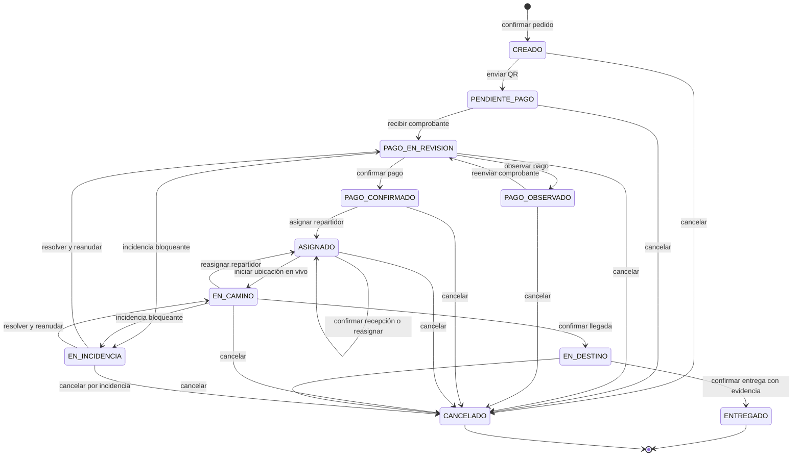

# Máquina de estados del pedido

## 1. Propósito

Este documento define el único modelo de estados que utilizarán el bot de Telegram y el panel web. Toda modificación del estado de un pedido debe pasar por las mismas reglas, independientemente del canal que origine el evento.

## 2. Alcance del modelo

La máquina comienza cuando el cliente confirma un carrito válido y el sistema crea el pedido. El carrito y los pasos conversacionales anteriores son datos temporales y no forman parte del estado persistente del pedido.

Cada estado se almacena con un código estable en la base de datos. Los nombres mostrados al usuario pueden ser más amigables, pero el bot y el panel deben interpretar los mismos códigos.

### Estado inicial

**CREADO** es el estado inicial. Se alcanza al crear el pedido de forma atómica con sus detalles, ubicación, código de seguimiento y descuento de stock.

### Estados finales

- **ENTREGADO:** la llegada ya fue registrada y existe evidencia válida de entrega.
- **CANCELADO:** el pedido fue cancelado con actor, motivo, fecha y hora.

Un estado final no admite nuevas transiciones de negocio.

## 3. Catálogo de estados

| Código | Nombre visible | Significado |
|---|---|---|
| `CREADO` | Pedido creado | El pedido fue persistido con sus datos obligatorios y todavía no se envió correctamente el QR. |
| `PENDIENTE_PAGO` | Pendiente de pago | El QR fue enviado y se espera el comprobante del cliente. |
| `PAGO_EN_REVISION` | Pago en revisión | El comprobante fue recibido y espera verificación manual. |
| `PAGO_OBSERVADO` | Pago observado | El administrador encontró una observación y el cliente debe enviar un nuevo comprobante. |
| `PAGO_CONFIRMADO` | Pago confirmado | El administrador validó manualmente el pago. |
| `ASIGNADO` | Repartidor asignado | Existe un único repartidor activo; puede confirmar la recepción o ser reasignado. |
| `EN_CAMINO` | En camino | El repartidor asignado inició el trayecto mediante la ubicación en vivo de Telegram. |
| `EN_DESTINO` | Repartidor en destino | El repartidor confirmó la llegada; la entrega todavía no fue confirmada. |
| `EN_INCIDENCIA` | Incidencia | Un problema bloqueante impide continuar y se conserva el último estado activo para una recuperación controlada. |
| `ENTREGADO` | Entregado | La entrega fue confirmada con evidencia válida. Estado final. |
| `CANCELADO` | Cancelado | La cancelación fue autorizada y registrada. Estado final. |

## 4. Diagrama de la máquina de estados

El diagrama muestra dos ejemplos de entrada y recuperación de una incidencia para conservar la legibilidad. La regla completa se encuentra en la tabla: cualquier estado activo puede pasar a **EN_INCIDENCIA** y solo puede regresar al estado activo previo después de resolver el problema y volver a validar sus condiciones.

## 5. Tabla de transiciones

| Estado de origen | Evento | Actor responsable | Condiciones | Estado de destino | Efectos principales |
|---|---|---|---|---|---|
| Sin pedido | `CONFIRMAR_PEDIDO` | Cliente mediante el bot | Carrito no vacío, ubicación válida y stock suficiente. | `CREADO` | Crea pedido, detalles, código de seguimiento e historial; descuenta stock en la misma transacción. |
| `CREADO` | `ENVIAR_QR` | Sistema | Existe un QR configurado y Telegram confirma el envío. | `PENDIENTE_PAGO` | Registra el envío del QR y notifica el estado. |
| `PENDIENTE_PAGO` | `ADJUNTAR_COMPROBANTE` | Cliente | Archivo permitido, no vacío y asociado al pedido correcto. | `PAGO_EN_REVISION` | Guarda el comprobante y avisa al administrador sin confirmar el pago. |
| `PAGO_EN_REVISION` | `OBSERVAR_PAGO` | Administrador | El comprobante presenta una observación y se registra el motivo. | `PAGO_OBSERVADO` | Notifica al cliente que debe corregir o reenviar el comprobante. |
| `PAGO_OBSERVADO` | `REENVIAR_COMPROBANTE` | Cliente | Nuevo archivo válido asociado al mismo pedido. | `PAGO_EN_REVISION` | Sustituye la referencia activa al comprobante y conserva el historial anterior. |
| `PAGO_EN_REVISION` | `CONFIRMAR_PAGO` | Administrador | El comprobante fue revisado y corresponde al pedido. | `PAGO_CONFIRMADO` | Registra administrador, fecha y hora; habilita la asignación. |
| `PAGO_CONFIRMADO` | `ASIGNAR_REPARTIDOR` | Administrador | Repartidor registrado y activo; el pedido no tiene otra asignación activa. | `ASIGNADO` | Crea la asignación y envía al repartidor el mensaje completo y la ubicación. |
| `ASIGNADO` | `CONFIRMAR_RECEPCION` | Repartidor asignado | La asignación continúa activa. | `ASIGNADO` | Registra el acuse una sola vez y avisa al administrador. |
| `ASIGNADO` | `REASIGNAR_REPARTIDOR` | Administrador | Nuevo repartidor registrado y distinto del anterior. | `ASIGNADO` | Desactiva la asignación anterior, crea una nueva y conserva un único repartidor activo. |
| `ASIGNADO` | `INICIAR_TRAYECTO` | Repartidor asignado | Acuse registrado y `live location` válida de Telegram. | `EN_CAMINO` | Inicia el rastro y notifica al cliente que el pedido está en camino. |
| `EN_CAMINO` | `REASIGNAR_REPARTIDOR` | Administrador | Existe un motivo y un nuevo repartidor registrado. | `ASIGNADO` | Finaliza el seguimiento anterior; el nuevo repartidor debe aceptar e iniciar su propio trayecto. |
| `EN_CAMINO` | `ACTUALIZAR_UBICACION` | Sistema a partir de Telegram | Ubicación del repartidor activo, con marca temporal no duplicada. | `EN_CAMINO` | Añade un punto al rastro sin cambiar el estado ni duplicar eventos. |
| `EN_CAMINO` | `CONFIRMAR_LLEGADA` | Repartidor asignado | La asignación está activa y existe una ubicación disponible. | `EN_DESTINO` | Registra llegada, fecha, hora y ubicación; notifica al cliente y al panel. |
| `EN_DESTINO` | `CONFIRMAR_ENTREGA` | Repartidor asignado | Existe evidencia válida: fotografía o código proporcionado por el cliente. | `ENTREGADO` | Registra evidencia, fecha, hora y repartidor; detiene el seguimiento y notifica la entrega. |
| Cualquier estado activo | `REGISTRAR_INCIDENCIA` | Sistema o administrador | El problema es bloqueante y no corresponde a un fallo temporal recuperable mediante reintento. | `EN_INCIDENCIA` | Conserva el estado previo, registra el motivo y bloquea nuevas transiciones normales. |
| `EN_INCIDENCIA` | `RESOLVER_INCIDENCIA` | Administrador o sistema | El problema fue resuelto y siguen cumpliéndose las condiciones del estado previo. | Estado activo previo | Registra la solución y reanuda exactamente el estado anterior, sin saltar etapas. |
| Cualquier estado activo o `EN_INCIDENCIA` | `CANCELAR_PEDIDO` | Administrador | Motivo obligatorio; el pedido no está entregado ni cancelado. | `CANCELADO` | Detiene el seguimiento, desactiva la asignación y restituye el stock una sola vez cuando corresponda. |

## 6. Cancelación

El comando `/cancelar` antes de crear el pedido limpia el carrito y la ubicación temporales; como todavía no existe un pedido, no produce una transición de esta máquina.

Una vez creado el pedido:

- El bot no lo cancela silenciosamente al reiniciar la conversación.
- La cancelación persistente la ejecuta el administrador con un motivo.
- La operación registra el estado anterior, actor, fecha y hora.
- Si existe una asignación activa, se desactiva y el repartidor pierde acceso operativo.
- Si existe seguimiento, se detiene y se conserva el rastro registrado.
- El stock se restituye como máximo una vez.
- Si el pago ya fue confirmado, el sistema registra el caso para atención manual; el MVP no realiza reembolsos automáticos.
- No se puede cancelar un pedido ya entregado.

## 7. Errores, pérdida de señal y acciones repetidas

### Errores temporales

Un fallo temporal de red, Telegram o base de datos no cambia por sí solo el estado del pedido. La operación se revierte o se reintenta y el estado confirmado permanece intacto.

### Incidencias bloqueantes

Se utiliza **EN_INCIDENCIA** únicamente cuando el pedido no puede continuar sin intervención. Al entrar se registra el estado previo. Al resolverla se revalidan sus condiciones y se retorna a ese mismo estado; nunca se usa la incidencia para saltar el pago, la asignación, la llegada o la evidencia.

### Pérdida de señal

`SIN_SEÑAL` es un indicador del seguimiento, no un estado del pedido:

- Si pasan 60 segundos sin ubicación, el pedido permanece en **EN_CAMINO**.
- El panel muestra la última posición y su hora.
- Al recuperar la conexión, el rastro continúa para el mismo pedido y repartidor.
- La pérdida de señal no produce entrega, cancelación ni incidencia automáticamente.

### Acciones repetidas

Las operaciones utilizan una clave de idempotencia o verifican el último evento equivalente. Una repetición devuelve el resultado ya registrado sin crear otro historial, descontar stock, enviar notificaciones ni almacenar evidencia dos veces.

### Transición inválida

Una transición inválida:

1. Se rechaza sin modificar el pedido.
2. No crea un evento de cambio de estado.
3. Informa el estado actual y las acciones permitidas.
4. Puede registrarse en la auditoría técnica sin confundirse con el historial válido.

## 8. Transiciones no permitidas

| Intento | Motivo del rechazo |
|---|---|
| `CREADO` o `PENDIENTE_PAGO` → `ASIGNADO` | No se puede asignar reparto sin pago confirmado. |
| Cualquier estado anterior → `ENTREGADO` | Deben existir primero `EN_DESTINO` y evidencia válida. |
| `ASIGNADO` → `EN_DESTINO` | El trayecto debe iniciarse mediante `live location`. |
| `EN_CAMINO` → `ENTREGADO` | La llegada y la entrega son eventos distintos. |
| Cambio solicitado por un repartidor no asignado | Solo el repartidor activo puede operar el pedido. |
| `ENTREGADO` o `CANCELADO` → cualquier otro estado | Los estados finales son inmutables. |
| Asignar dos repartidores activos | Cada pedido admite un único repartidor activo. |
| Confirmar pago, llegada o entrega por segunda vez | La operación es idempotente y no duplica efectos. |
| Cambiar el estado directamente desde el bot o el panel | Ambos canales deben solicitar un evento válido al servicio compartido. |

## 9. Historial y consistencia

Cada transición aceptada registra como mínimo:

- Pedido.
- Estado anterior y estado nuevo.
- Evento.
- Tipo e identificador del actor.
- Fecha y hora.
- Motivo cuando corresponda.
- Referencia a comprobante, ubicación o evidencia cuando corresponda.

La actualización del pedido y la creación del historial se ejecutan en una única transacción. La escritura verifica el estado esperado para evitar que dos acciones concurrentes apliquen transiciones incompatibles.

Las notificaciones se envían después de confirmar la transacción. Un fallo al notificar se registra para reintento y no altera una transición ya confirmada.

El bot y el panel deben invocar un único servicio de aplicación para consultar y ejecutar transiciones; ninguno puede escribir el estado directamente.

## 10. Relación con otros documentos

- [Requisitos e historias de usuario](requisitos.md)
- [Decisiones técnicas](decisiones-tecnicas.md)

Este documento es la referencia de diseño para la implementación. Si el código exige modificar un estado o una transición, el cambio deberá registrarse en esta máquina y en la bitácora de decisiones antes de integrarse.
